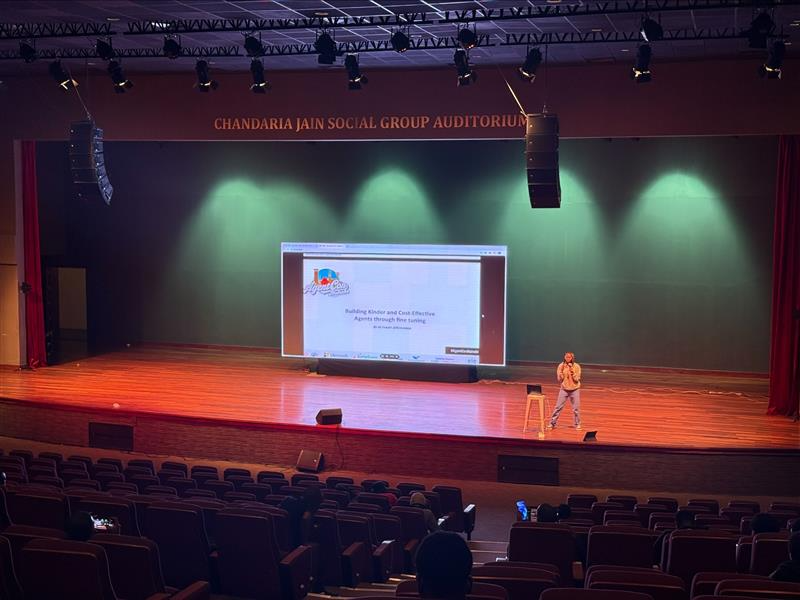

Participated in the second AgentCon Nairobi 2025 at Shree Sthanakvasi Jain Sangh, delivering a comprehensive session on Building Kinder and Cost-Effective Agents through fine tuning.

## Session: Building Kinder and Cost-Effective Agents through fine tuning



Learn how to customize AI models for a retail customer service agent using Microsoft Foundry. In this session we will discuss how you can optimize your model through options such as SFT and distillation to reduce latency and token costs and improve the tone of your models. I will also cover how you can synthetically generate your data and create a custom grader to give our model proper guidance for fine tuning. Lastly, we will talk about production, how you can deploy and evaluate your  retail customer service agent.

## Resources

- [The demo resources](https://aka.ms/MicrosoftAITour/BRK443)
- [AgentCon Conference Series](https://globalai.community/chapters/nairobi/events/agentcon-nairobi/)
- [Video Series based on session](https://www.youtube.com/watch?v=GyCLzGQwaEc&list=PLlrxD0HtieHj61bBwrAqd5yHvwjB8s_oz&index=23)


